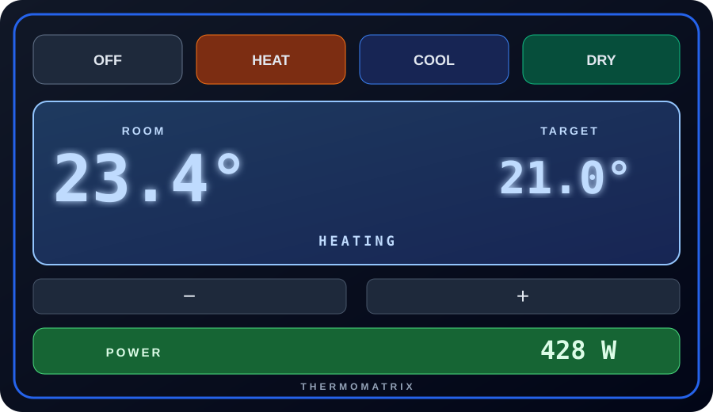

# ThermoMatrix Card

Una card Lovelace modulare in stile LCD per controllare entità `climate` in
Home Assistant.



## Aspetto reale

| Italiano · tema chiaro | Italiano · tema scuro |
| --- | --- |
|  |  |

| English · light theme | English · dark theme |
| --- | --- |
|  |  |

> Stato del progetto: versione di sviluppo installabile come archivio
> personalizzato HACS.

## Funzioni già previste

- modalità HVAC generate automaticamente da `hvac_modes`;
- temperatura ambiente e target con display a sette segmenti;
- indicatori LCD `ON`, `IDLE` e `OFF`;
- regolazione della temperatura;
- preset generati automaticamente e disattivabili;
- modulo opzionale per un sensore di consumo, con valore a sette segmenti;
- stato operativo avanzato opzionale all'interno del display LCD;
- bordo dinamico secondo la modalità o neutro;
- adattamento al tema chiaro e scuro;
- lingua rilevata automaticamente da Home Assistant, con possibilità di
  selezione manuale;
- configurazione dall'editor visuale di Home Assistant.

## Configurazione di sviluppo

```yaml
type: custom:thermomatrix-card
entity: climate.termostato_sala
show_presets: true
show_consumption: false
border_mode: state
temperature_step: 0.1
language: auto
hvac_button_labels: auto
preset_button_labels: auto
```

### Etichette responsive dei pulsanti

Le etichette delle modalità HVAC e dei preset sono configurabili
indipendentemente:

```yaml
hvac_button_labels: auto
preset_button_labels: auto
```

I valori disponibili sono:

- `auto` — mostra icona e testo quando entrano correttamente nel pulsante,
  altrimenti mantiene soltanto l'icona;
- `show` — mostra sempre icona e testo;
- `hide` — mostra soltanto l'icona.

In tutte le modalità il nome completo rimane disponibile come tooltip e come
etichetta accessibile.

### Indicatore di stato meccanico

Senza un `status_entity` dedicato, lo stato `ON`, `IDLE` oppure `OFF` viene
mostrato su quattro rotelle alfabetiche animate. Le lettere adiacenti rimangono
parzialmente visibili per simulare un contatore elettromeccanico.

Quando è configurato `status_entity`, la riga di stato estesa sostituisce le
rotelle e il nuovo valore entra dal basso con una breve rotazione verticale.
L'animazione parte soltanto quando cambia il valore ed è disabilitata se il
sistema richiede la riduzione dei movimenti.

## Lingue

Il valore predefinito `language: auto` usa la lingua del profilo Home
Assistant. Se la lingua non è ancora supportata, la card utilizza l'inglese.

Le traduzioni incluse sono inglese, italiano, spagnolo, francese, tedesco e
portoghese. È anche possibile forzare una lingua:

```yaml
language: es
```

I valori ammessi sono `auto`, `en`, `it`, `es`, `fr`, `de` e `pt`.

Con il modulo consumo:

```yaml
type: custom:thermomatrix-card
entity: climate.termostato_sala
show_presets: true
show_consumption: true
power_entity: sensor.climatizzatore_power
border_mode: state
```

### Stato operativo avanzato

È possibile indicare un'entità separata tramite `status_entity` per mostrare
stati specifici, ad esempio `In attivazione` o `In spegnimento`, ricavati da
un'automazione o dal sensore di consumo. Il testo viene mostrato su una riga a
tutta larghezza sotto le temperature, dentro il display LCD, e sostituisce gli
indicatori `ON`, `IDLE` e `OFF`:

```yaml
type: custom:thermomatrix-card
entity: climate.termostato_sala
status_entity: sensor.stato_climatizzatore
show_consumption: true
power_entity: sensor.climatizzatore_power
```

`status_entity` è una funzione opzionale pensata per impianti che espongono
fasi operative aggiuntive. Se non viene configurata, la card mantiene i normali
indicatori `ON`, `IDLE` e `OFF` e non aggiunge altri riquadri.

## Sviluppo

```shell
npm install
npm run build
```

Il file destinato a Home Assistant e HACS viene generato in
`dist/thermomatrix-card.js`.

## Prova manuale in Home Assistant

1. Copiare `dist/thermomatrix-card.js` in
   `/config/www/thermomatrix-card.js`.
2. Aggiungere una risorsa JavaScript di tipo modulo con URL
   `/local/thermomatrix-card.js`.
3. Aggiungere una nuova card scegliendo **ThermoMatrix Card** dall'editor,
   oppure usare uno degli esempi YAML riportati sopra.
4. Dopo ogni aggiornamento del file, ricaricare completamente il browser per
   evitare la cache della risorsa precedente.

## Distribuzione

Il repository finale conterrà `hacs.json` nella radice e
`dist/thermomatrix-card.js`, come richiesto da HACS per le card Dashboard.

## Licenza

Distribuito con licenza [MIT](LICENSE).
