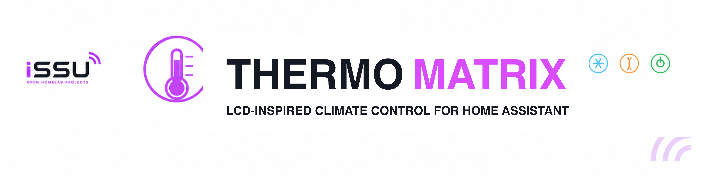
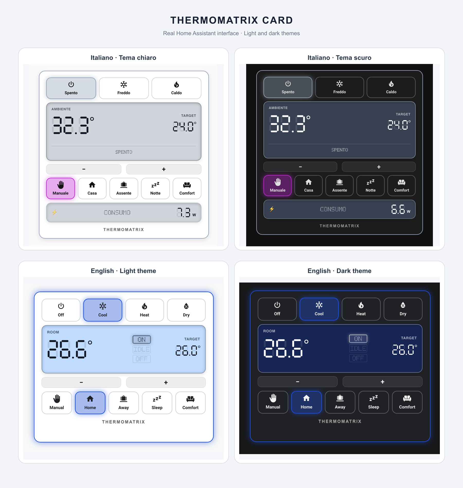

<div align="center">

[](#project-status)
[](https://www.home-assistant.io/)
[](https://www.hacs.xyz/)
[](LICENSE)

**An LCD-inspired climate card for Home Assistant.**

ThermoMatrix provides a clear climate control interface with seven-segment temperatures, automatic HVAC controls, presets and optional power monitoring.

</div>

---

## Project Status

| Field | Current state |
|---|---|
| **Maturity** | 🟡 Active Development |
| **Used in my homelab** | ✅ Yes |
| **Recommended for production** | ❌ Not yet |
| **Setup difficulty** | 🟢 Beginner |
| **Documentation** | 🟡 In progress |

> [!NOTE]
> **Beginner setup:** installation is handled by HACS. After adding the custom repository, select a climate entity in the visual card editor.

> [!WARNING]
> ThermoMatrix is under active development. Options and visual details may change between versions.

---

## Why It Exists

ThermoMatrix was created for my own Home Assistant dashboards. I wanted a climate card that was compact, easy to read and visually different from standard controls.

The card is built for daily use first, then shared so other Home Assistant users can install and adapt it.

---

## Features

- 🌡️ Seven-segment room and target temperatures.
- 🔄 HVAC buttons generated automatically from the entity's `hvac_modes`.
- 🎛️ Automatic preset controls that can be disabled.
- 🟢 LCD-style `ON`, `IDLE` and `OFF` indicators.
- 🎞️ Optional mechanical wheel status display.
- ⚡ Optional power-consumption module.
- 📋 Optional extended status from a separate entity.
- 🎨 Dynamic or neutral borders.
- 🌓 Automatic light and dark theme support.
- 🌍 Automatic Home Assistant language detection.
- 🖱️ Visual configuration editor.
- ♿ Accessible labels, tooltips and reduced-motion support.

---

## Interface

The gallery below shows the current card in real Home Assistant dashboards with light and dark themes.



---

## Installation with HACS

ThermoMatrix is installed as a HACS custom repository. Manual copying of the JavaScript file is not required.

1. Open **HACS** in Home Assistant.
2. Open the menu in the top-right corner.
3. Select **Custom repositories**.
4. Add this repository URL:

```text
https://github.com/issu-lab/thermomatrix-card
```

5. Select **Dashboard** as the repository type. Depending on the interface language or HACS version, it may appear as **Plancia** or use the older name **Plugin**.
6. Select **Add**.
7. Search for **ThermoMatrix Card** in HACS.
8. Open it and select **Download**.
9. Refresh the Home Assistant browser page after installation.

HACS manages the dashboard resource automatically.

> [!TIP]
> The general procedure is also described in the [HACS custom repository documentation](https://www.hacs.xyz/docs/faq/custom_repositories/).

---

## Add the Card

1. Open a Home Assistant dashboard.
2. Enter dashboard edit mode.
3. Select **Add card**.
4. Search for **ThermoMatrix Card**.
5. Select the climate entity and configure the available options in the visual editor.

A minimal YAML configuration is also available:

```yaml
type: custom:thermomatrix-card
entity: climate.living_room
```

---

## Configuration Example

```yaml
type: custom:thermomatrix-card
entity: climate.living_room
show_presets: true
show_consumption: false
border_mode: state
temperature_step: 0.1
language: auto
hvac_button_labels: auto
preset_button_labels: auto
status_display: wheel
```

### Main options

| Option | Purpose |
|---|---|
| `entity` | Climate entity controlled by the card. |
| `show_presets` | Shows presets reported by the climate entity. |
| `show_consumption` | Enables the optional power module. |
| `power_entity` | Sensor used by the power module. |
| `status_entity` | Optional entity used for extended operating states. |
| `border_mode` | Uses a state-based or neutral border. |
| `temperature_step` | Temperature adjustment step. |
| `language` | Uses automatic or manually selected translations. |
| `hvac_button_labels` | Controls HVAC button text visibility. |
| `preset_button_labels` | Controls preset button text visibility. |
| `status_display` | Selects the mechanical wheel or LCD indicators. |

---

## Responsive Button Labels

HVAC and preset labels can be configured independently:

```yaml
hvac_button_labels: auto
preset_button_labels: auto
```

Available values:

- `auto` — shows the icon and text when they fit, otherwise keeps only the icon.
- `show` — always shows both icon and text.
- `hide` — shows only the icon.

The complete name remains available as a tooltip and accessible label.

---

## Status Display

The default `wheel` display uses four animated LCD character wheels to show `--ON`, `-OFF` or `IDLE`.

To use the original LCD indicators instead:

```yaml
status_display: indicators
```

Available values are `wheel` and `indicators`.

If `status_entity` is configured, its value replaces the standard status display with a full-width status line. The animation runs only when the value changes and is disabled when reduced motion is requested.

```yaml
type: custom:thermomatrix-card
entity: climate.living_room
status_entity: sensor.climate_status
```

---

## Power Monitoring

Enable the optional consumption module with a compatible power sensor:

```yaml
type: custom:thermomatrix-card
entity: climate.living_room
show_consumption: true
power_entity: sensor.climate_power
border_mode: state
```

---

## Languages

The default value is:

```yaml
language: auto
```

ThermoMatrix follows the Home Assistant profile language and falls back to English when the selected language is unavailable.

Included translations:

- English
- Italian
- Spanish
- French
- German
- Portuguese

A language can also be selected manually:

```yaml
language: it
```

Supported values are `auto`, `en`, `it`, `es`, `fr`, `de` and `pt`.

---

## Development

```shell
npm install
npm run build
```

The Home Assistant and HACS distributable is generated at:

```text
dist/thermomatrix-card.js
```

---

## Known Limitations

- The project is still evolving and configuration options may change.
- Installation currently requires adding the repository manually to HACS.
- Compatibility has not yet been documented across multiple Home Assistant versions.
- The visual result depends on the features exposed by the selected climate entity.

---

## License

Released under the [MIT License](LICENSE).

---

<div align="center">

This project is part of the **iSSU Open Homelab ecosystem**.

<a href="https://github.com/issu-lab/Open-Homelab">
  
</a>

</div>
